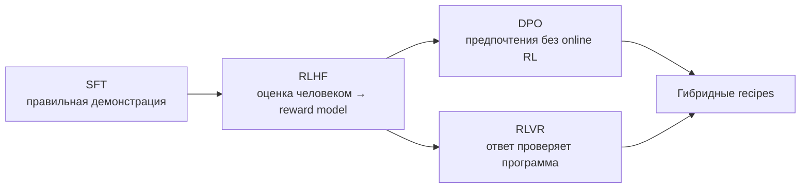

# Выравнивание: RLHF → DPO → RLVR

## Тезис

Линия развивается не как простая замена одного алгоритма другим, а как поиск
более масштабируемого сигнала обучения:

- **SFT** учит имитировать хорошие ответы.
- **RLHF** оптимизирует модель по приближённому человеческому предпочтению.
- **DPO** превращает пары предпочтений в прямой classification-like objective.
- **RLVR** использует проверяемый reward для математики, кода и tool use.

## Хронология

| Этап | Что изменилось | Что осталось проблемой |
|---|---|---|
| Preference learning | люди сравнивают ответы | дорогая и шумная разметка |
| [[02 Areas/ML & DL/Concepts/Training/RLHF|RLHF]] + [[02 Areas/ML & DL/Concepts/Training/PPO|PPO]] | reward model допускает online exploration | сложность стека, reward hacking |
| [[02 Areas/ML & DL/Concepts/Training/DPO|DPO]] | нет отдельного RM и rollout-loop | качество зависит от offline preference data |
| [[02 Areas/ML & DL/Concepts/Training/GRPO|GRPO]] | group-relative baseline без critic | чувствительность к sampling и reward design |
| [[02 Areas/ML & DL/Concepts/Training/RLVR|RLVR]] | reward можно вычислить точно | применимо только там, где ответ проверяем |

## DeepSeek-R1 как важный узел

[[02 Areas/ML & DL/05 Источники/Papers/DeepSeek-R1|DeepSeek-R1]] показал две
разные вещи, которые важно не смешивать:

1. **R1-Zero:** reasoning-поведение можно усилить pure RL с rule-based rewards.
2. **R1:** практичная модель всё равно использует многостадийный pipeline:
   cold-start SFT, reasoning RL, rejection sampling и финальный alignment RL.

Следовательно, результат не доказывает, что SFT или preference data больше не
нужны. Он показывает силу проверяемого outcome reward в подходящих доменах.

## Сравнение

| Метод | Источник сигнала | Online rollouts | Сильная сторона | Главный риск |
|---|---|---:|---|---|
| SFT | демонстрации | нет | стабильность и стиль | imitation ceiling |
| RLHF | learned RM | да | open-ended preferences | reward hacking |
| DPO | preference pairs | нет | простой pipeline | нет exploration |
| RLVR | verifier | да | точный масштабируемый reward | узкий набор задач |

## Доказательства и ограничения

- Верифицируемый **финальный ответ** не гарантирует правильную цепочку рассуждений.
- Binary reward создаёт sparse signal; curriculum и sampling становятся частью метода.
- Один и тот же verifier можно эксплуатировать shortcut-стратегией.
- Для helpfulness, safety и творческих задач learned/human feedback остаётся нужен.
- Benchmark gain нельзя автоматически переносить на надёжность в production.

## Открытые вопросы

- Когда process supervision лучше outcome supervision?
- Как обучать корректному отказу, если verifier оценивает только успех?
- Как избежать overthinking и роста стоимости inference?
- Переносятся ли RLVR-навыки за пределы распределения задач и верификаторов?
- Как сочетать verifiable и preference rewards без взаимной деградации?

## Связанные страницы

[[02 Areas/ML & DL/Concepts/Training/Reward Model|Reward Model]] ·
[[02 Areas/ML & DL/Concepts/Training/Alignment|Alignment]] ·
[[02 Areas/ML & DL/Concepts/Architectures/DeepSeek-R1|DeepSeek-R1]] ·
[[02 Areas/ML & DL/Papers/DPO|DPO paper]] ·
[[02 Areas/ML & DL/Papers/InstructGPT|InstructGPT]]
