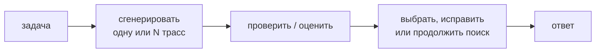

# Reasoning и test-time compute

## Тезис

Качество можно масштабировать не только параметрами и training compute, но и
вычислениями на конкретный запрос:

## Четыре разных механизма

| Механизм | Дополнительное вычисление |
|---|---|
| [[02 Areas/ML & DL/Concepts/Inference/Chain of Thought|Chain of Thought]] | больше последовательных токенов |
| [[02 Areas/ML & DL/Concepts/Reasoning/Self-Consistency|Self-Consistency]] | несколько независимых решений |
| search / tree methods | ветвление и оценка промежуточных состояний |
| tool-assisted reasoning | внешнее вычисление и наблюдение |

Длинный скрытый текст не является доказательством reasoning. Нужен выигрыш на
контролируемых задачах, устойчивость к переформулировке и проверка результата.

## Training-time связь

[[02 Areas/ML & DL/Concepts/Training/RLVR|RLVR]] создаёт давление в пользу
стратегий, которые повышают проверяемый outcome. Distillation затем переносит
часть этих стратегий в меньшие модели. Поэтому «reasoning model» — обычно не
новый Transformer block, а сочетание post-training, decoding policy и budget.

## Trade-offs

- больше токенов увеличивает latency и стоимость;
- majority vote помогает лишь при достаточно независимых ошибках;
- verifier может быть слабее генератора или эксплуатироваться им;
- overthinking ухудшает простые задачи;
- faithful explanation и эффективная внутренняя стратегия не одно и то же.

## Открытые вопросы

- Как адаптивно выбирать budget до знания сложности задачи?
- Можно ли надёжно проверять промежуточные шаги?
- Когда search лучше одной длинной trajectory?
- Как измерять reasoning без contamination и style bias?
- Какие навыки возникают через RL, а какие лишь становятся видимее?

## Связанные страницы

[[02 Areas/ML & DL/Concepts/Reasoning/Test-time Compute|Test-time Compute]] ·
[[02 Areas/ML & DL/Concepts/Reasoning/Tree of Thoughts|Tree of Thoughts]] ·
[[02 Areas/ML & DL/Concepts/Architectures/DeepSeek-R1|DeepSeek-R1]] ·
[[02 Areas/ML & DL/Papers/COT|Chain-of-Thought paper]]
