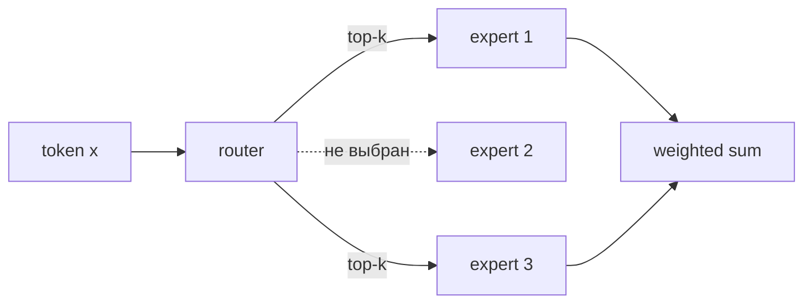

# Sparse- и MoE-модели

## Тезис

Sparse-модель хранит много параметров, но активирует лишь часть вычислительного
графа для каждого токена. В MoE sparsity обычно находится в FFN:

## Что даёт MoE

- больше total parameters при близком active compute;
- специализацию экспертов;
- лучший quality/compute trade-off при достаточном масштабе.

Но total parameters всё равно нужно хранить и перемещать. MoE переносит нагрузку
из матричных вычислений в routing, коммуникацию и memory bandwidth.

## Исследовательские ветви

| Ветка | Вопрос |
|---|---|
| routing | как выбирать экспертов устойчиво и дифференцируемо |
| load balancing | как не допустить перегрузки нескольких экспертов |
| shared experts | какие знания должны быть доступны каждому токену |
| expert granularity | много малых или мало крупных экспертов |
| systems | как разместить экспертов между устройствами |
| interpretability | действительно ли эксперты специализируются семантически |

## Ограничения доказательств

- Сравнение active parameters скрывает стоимость хранения total parameters.
- FLOPs не отражают all-to-all communication.
- «Эксперт по теме» часто является post-hoc интерпретацией, а не стабильным
  свойством.
- Dense и MoE checkpoints могут иметь разные данные и training budgets.

## Открытые вопросы

- Можно ли маршрутизировать не только FFN, но и память/attention?
- Как сделать routing устойчивым при domain shift?
- Как quantization влияет на router и редких экспертов?
- Когда MoE выгоден при малом batch и edge inference?

## Связанные страницы

[[02 Areas/ML & DL/Concepts/Architectures/MoE|MoE]] ·
[[02 Areas/ML & DL/00 Учебник/09 Dense FFN и Mixture of Experts/01 От SwiGLU к MoE|От SwiGLU к MoE]] ·
[[02 Areas/ML & DL/Concepts/Architectures/Mixtral of Experts|Mixtral]] ·
[[02 Areas/ML & DL/Concepts/Architectures/DeepSeek-V3|DeepSeek-V3]]
