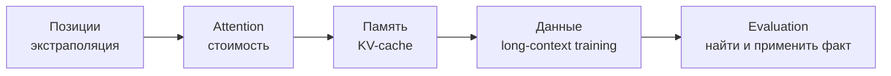

# Длинный контекст

## Тезис

Размер context window — только верхняя граница входа. Полезный длинный контекст
требует одновременно решить четыре разные задачи:

## Карта подходов

| Задача | Подходы | Компромисс |
|---|---|---|
| позиции | RoPE scaling, interpolation, learned biases | extrapolation может искажать локальные расстояния |
| quadratic attention | sliding window, sparse/global tokens, recurrence | теряется часть all-to-all взаимодействий |
| KV-cache | [[02 Areas/ML & DL/Concepts/Architectures/GQA|GQA]], latent compression, quantization | качество против памяти |
| знания вне окна | [[02 Areas/ML & DL/Concepts/Retrieval/Retrieval-Augmented Generation|RAG]] | retrieval errors и сложность системы |

## Что проверять в заявлениях о контексте

1. Максимум токенов в config или реально обученный диапазон?
2. Есть ли качество на *позиционных* тестах, а не только needle retrieval?
3. Может ли модель объединить несколько удалённых фактов?
4. Как растут latency и память?
5. Сохраняется ли качество на коротких запросах?

## Споры

- **Long context или RAG:** они дополняют друг друга. Контекст хранит рабочее
  состояние; retrieval выбирает релевантные данные из большего корпуса.
- **Needle-in-a-haystack:** полезный sanity check, но слабая модель реального
  анализа документов.
- **Заявленный window:** сам по себе не означает эффективное использование всей
  длины и не сравним между разными tokenizer-ами.

## Открытые вопросы

- Как оценивать композиционное рассуждение на сотнях тысяч токенов?
- Нужен ли полный attention или достаточно адаптивно выбранной памяти?
- Как обучать модель забывать нерелевантное?
- Где проходит экономическая граница между длинным prompt и retrieval?

## Связанные страницы

[[02 Areas/ML & DL/Concepts/Architectures/RoPE|RoPE]] ·
[[02 Areas/ML & DL/Concepts/Inference/KV-Cache|KV-cache]] ·
[[02 Areas/ML & DL/Concepts/Architectures/Mistral 7B|Mistral 7B]] ·
[[02 Areas/ML & DL/Concepts/Architectures/Kimi|Kimi]]
