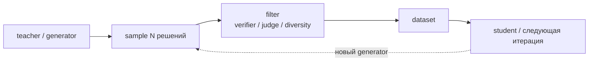

# Синтетические данные и дистилляция

## Тезис

Модель становится не только обучаемым объектом, но и фабрикой данных:

Качество определяется не одним teacher, а всей системой генерации, фильтрации,
смешивания и проверки.

## Основные режимы

| Режим | Цель | Риск |
|---|---|---|
| knowledge distillation | перенести distribution/logits | student наследует ошибки |
| instruction synthesis | расширить task coverage | шаблонность и contamination |
| rejection sampling | оставить лучшие trajectories | bias фильтра или judge |
| self-training | итеративно учиться на своих predictions | model collapse |
| reasoning distillation | перенести удачные решения | имитация формы вместо навыка |

## DeepSeek-R1

В R1 дистилляция — отдельный результат, не эквивалентный RL. Малые Qwen/Llama
модели обучались на сгенерированных reasoning-примерах сильной модели и получили
значительный прирост. Это показывает, что часть наблюдаемого поведения можно
передать supervised objective, но не доказывает равенство внутреннего процесса.

## Практический quality gate

Синтетический датасет нужно описывать через:

1. происхождение seed-задач;
2. generator и sampling parameters;
3. verifier/judge;
4. deduplication и contamination checks;
5. diversity;
6. долю синтетики в смеси;
7. независимую human evaluation.

## Открытые вопросы

- Когда итеративная генерация сужает distribution?
- Как отличить полезный curriculum от benchmark contamination?
- Нужны ли полные reasoning traces или достаточно ответов/критики?
- Как измерить разнообразие на уровне стратегии, а не слов?
- Какие данные выгоднее генерировать, а какие — собирать у людей?

## Связанные страницы

[[02 Areas/ML & DL/Concepts/Training/Synthetic Data|Synthetic Data]] ·
[[02 Areas/ML & DL/Concepts/Training/Distillation|Distillation]] ·
[[02 Areas/ML & DL/Concepts/Training/SFT|SFT]] ·
[[02 Areas/ML & DL/05 Источники/Papers/DeepSeek-R1|DeepSeek-R1]]
