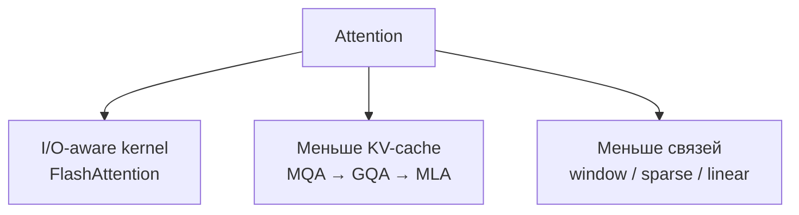

# Эффективный attention

## Тезис

«Эффективность attention» обозначает минимум три независимые оптимизации:

- kernel сохраняет математический результат, но считает его эффективнее;
- KV-компрессия меняет представление ключей и значений;
- sparse/linear pattern меняет множество доступных взаимодействий.

## Сравнение

| Подход | Экономит | Меняет модель | Типичная цена |
|---|---|---:|---|
| [[02 Areas/ML & DL/Concepts/Inference/Flash Attention|FlashAttention]] | HBM I/O, activations | нет | сложный kernel |
| MQA | KV-cache | да | возможная потеря качества |
| [[02 Areas/ML & DL/Concepts/Architectures/GQA|GQA]] | KV-cache | да | компромисс MHA/MQA |
| [[02 Areas/ML & DL/Concepts/Training/Multi-head Latent Attention|MLA]] | KV-cache | да | сложные проекции и реализация |
| sliding window | FLOPs/память на длинном входе | да | ограниченная дальняя связь |

## Основная ошибка сравнения

Training throughput, prefill latency, decode latency и peak memory — разные
метрики. FlashAttention особенно важен для больших матриц prefill/training;
KV-cache compression — для memory-bound autoregressive decoding.

## Открытые вопросы

- Какие compression schemes лучше сохраняют качество после fine-tuning?
- Когда structured sparsity превосходит dense optimized kernels на реальном GPU?
- Можно ли выбирать attention pattern динамически для каждого токена?
- Как честно сравнивать kernels на разных длинах, batch size и hardware?

## Связанные страницы

[[02 Areas/ML & DL/00 Учебник/08 Эффективный Attention и длинный контекст/01 MHA, MQA и GQA|MHA, MQA и GQA]] ·
[[02 Areas/ML & DL/00 Учебник/08 Эффективный Attention и длинный контекст/02 MLA и сжатие KV-cache|MLA]] ·
[[02 Areas/ML & DL/Papers/Flash Attention|FlashAttention paper]] ·
[[02 Areas/ML & DL/Papers/DeepSeek-V2|DeepSeek-V2]]
