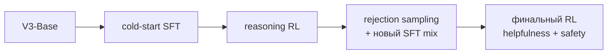

# DeepSeek-R1

> [Paper](https://arxiv.org/abs/2501.12948) ·
> [официальный repository](https://github.com/deepseek-ai/DeepSeek-R1) ·
> [[02 Areas/ML & DL/Papers/DeepSeek-R1 Reasoning via RL|подробный существующий конспект]]

## Почему источник важен

Paper стал опорной точкой сразу для трёх линий:

1. [[02 Areas/ML & DL/03 Исследовательские линии/RLHF → DPO → RLVR|RLVR и alignment]];
2. [[02 Areas/ML & DL/03 Исследовательские линии/Reasoning и test-time compute|reasoning и test-time compute]];
3. [[02 Areas/ML & DL/03 Исследовательские линии/Синтетические данные и дистилляция|reasoning distillation]].

## Что было сделано

### DeepSeek-R1-Zero

- база: DeepSeek-V3-Base;
- post-training: large-scale RL без предварительного reasoning SFT;
- алгоритм: [[02 Areas/ML & DL/Concepts/Training/GRPO|GRPO]];
- rewards: проверка правильности ответа и соблюдения формата;
- наблюдение: рост длины решения, self-verification и смена стратегий.

### DeepSeek-R1

Практичная версия использует многостадийный pipeline:

Это принципиально: R1-Zero исследует pure RL, тогда как итоговый R1 сочетает
SFT, verifiable rewards, синтетические данные и preference alignment.

## Главные выводы

- Проверяемый outcome reward способен усиливать математическое и программное
  reasoning без размеченных человеком reasoning traces.
- GRPO устраняет отдельную value model, используя относительные rewards внутри
  группы samples.
- Pure-RL checkpoint демонстрирует полезные стратегии, но имеет проблемы
  readability и смешения языков.
- Дистилляция R1-данных в меньшие Qwen/Llama checkpoints даёт сильный прирост;
  это отдельный механизм от RL.

## Что paper не доказывает

- Что SFT больше не нужен: финальная модель его использует.
- Что сгенерированный CoT является faithful описанием внутренних вычислений.
- Что rule-based reward подходит для open-ended helpfulness или safety.
- Что увеличение числа reasoning tokens всегда повышает качество.
- Что результаты автоматически переносятся на agentic и production-задачи.

## Термины

[[02 Areas/ML & DL/Concepts/Training/RLVR|RLVR]] ·
[[02 Areas/ML & DL/Concepts/Training/GRPO|GRPO]] ·
[[02 Areas/ML & DL/Concepts/Training/Distillation|Distillation]] ·
[[02 Areas/ML & DL/Concepts/Architectures/DeepSeek-R1|DeepSeek-R1]] ·
[[02 Areas/ML & DL/Concepts/Architectures/DeepSeek-V3|DeepSeek-V3]]
